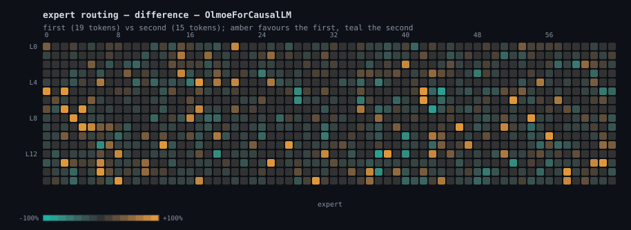

<div align="center">


### Every expert on tap.

CPU inference for sparse mixture-of-experts models.<br>
One binary. Linux, macOS, Windows. No GPU, no BLAS, no Python.

[](https://github.com/JGalego/Moe/actions/workflows/ci.yml)
[](https://github.com/JGalego/Moe/releases/latest)
[](#install)
[](https://www.rust-lang.org)
[](#why-another-engine)
[](LICENSE)

</div>

---

**Better call Moe!** Point it at a Hugging Face repo and it downloads, caches, and
works out what the model is by reading the weights — no config file, no conversion
step, no `--model-type`. About 3,300 lines of Rust.


The weights are fetched once with a progress bar, cached, and reused instantly on
every run after that.


## Why another engine

A sparse MoE checkpoint is mostly weights that any given token never touches.
Routing picks a handful of experts per layer, so the arithmetic per token stays
small even when the file is enormous — what actually hurts on a CPU is moving
bytes. Moe is built around that one observation:

- **Copy-free.** Weights are memory mapped and read in place, in whatever format
  they already have. Loading a checkpoint is an `mmap` call, not a deserialise
  pass, so start-up is instant and the resident set is whatever the OS decides to
  keep — a model larger than RAM streams from disk with no special mode.
- **Only what routing selects.** A routed layer touches the experts it chose and
  nothing else. Expert weights are addressed as row ranges inside the checkpoint,
  including the fused `[experts, 2*inter, hidden]` stacks that current exports
  use, so selecting an expert costs an offset calculation.
- **One code path for prefill and decode.** A step takes `t` tokens; decode is
  `t == 1`. Each weight row is dequantised once and dotted against every token in
  the batch, so prefill reads each weight once rather than once per token, and
  the MoE layer runs each selected expert once over all the tokens that chose it.
- **Detected, not configured.** Nothing about the architecture is hard-coded.
  Latent attention, qk-norm, sigmoid gating, group-limited routing, shared
  experts, dense-prefix layers — each is inferred from the tensors that exist.

## Install

A single binary with no runtime dependencies. Linux, macOS and Windows, x86-64
and arm64.

```console
# macOS / Linux
$ curl -fsSL https://raw.githubusercontent.com/JGalego/Moe/main/install.sh | sh

# Windows (PowerShell)
> irm https://raw.githubusercontent.com/JGalego/Moe/main/install.ps1 | iex
```

Or from source, with a Rust toolchain (1.75+):

```console
$ cargo install --git https://github.com/JGalego/Moe    # or: cargo build --release
$ cargo test                                            # full suite, no downloads, ~2s
```

Building from source compiles a TLS stack, which wants a C compiler. If you do
not have one — or do not want downloads at all — `--no-default-features` drops
both, leaving an engine that takes local paths. For the best kernels on your own
machine, build with `RUSTFLAGS="-C target-cpu=native"`.

## Use

`<model>` is whatever you have:

```console
$ moe run mistralai/Mixtral-8x7B-v0.1 -p "The capital of France is"   # Hub repo
$ moe run mistralai/Mixtral-8x7B-v0.1@refs/pr/7 -p ...                # a revision
$ moe run ~/models/mixtral -p ... --temp 0.7                          # local directory
$ moe run ./mixtral.moe -p ...                                        # packed file
$ moe run https://example.com/mixtral.moe -p ...                      # direct download
```

Remote models are downloaded once into a cache — `%LOCALAPPDATA%\moe` on
Windows, `~/Library/Caches/moe` on macOS, `$XDG_CACHE_HOME/moe` or `~/.cache/moe`
elsewhere — and reused after that. `MOE_CACHE` moves it, `HF_TOKEN` reaches gated
repos, `--offline` refuses to download, and `moe pull <model>` fetches without
running anything. From a repo, only the files inference reads are downloaded:
`config.json`, `tokenizer.json` and the weights, skipping the `.bin` duplicates,
demos and conversions that repos accumulate. A repo publishing a packed `.moe`
yields just that one file instead.

Then pack it, if you like. Packing re-quantises every weight, drops tensors
inference never reads, and embeds `tokenizer.json`, giving one self-contained
file:

```console
$ moe pack mistralai/Mixtral-8x7B-v0.1 --quant q8 --expert-quant q4
$ moe run ./Mixtral-8x7B-v0.1.moe -p "Explain routing in one sentence." --stats
```

`--quant` covers the dense trunk, `--expert-quant` the routed experts. Since the
experts are the bulk of the file and the least sensitive part of it, `--quant q8
--expert-quant q4` is a good default: Q8 costs 8.5 bits per weight and Q4 costs
4.5, so a bf16 checkpoint shrinks 1.88x and 3.56x respectively. Norms, biases and
router gates always stay f32 — they are tiny, and quantisation noise there feeds
straight into routing decisions.

Other commands:

```console
$ moe pull  <model>                    # download into the cache, print the path
$ moe info  <model>                    # architecture, footprint, kv cache size
$ moe bench <model> -n 64              # prefill and decode throughput
$ moe tokenize <model> -p "hello"      # token ids, for debugging
$ moe --help                           # every flag
```

Generation reads `--prompt`, `--prompt-file` or `--ids` (raw token ids, no
tokenizer needed). Sampling is greedy by default; `--temp`, `--top-p`, `--top-k`,
`--repeat-penalty` and `--seed` are there when you want them.

## Seeing the routing

`--trace` records which experts every token chose, and at what weight, as JSONL.
`scripts/routeviz.py` renders one trace as a heatmap, or two as their difference:

```console
$ moe run <model> -p "import numpy as np ..."   --trace code.jsonl
$ moe run <model> -p "The French Revolution ..." --trace prose.jsonl
$ python3 scripts/routeviz.py code.jsonl prose.jsonl -o routing.svg
```



Each cell is one expert in one layer; amber means the code prompt picked it more
often, teal the prose prompt, grey means neither. The strongly coloured cells are
the point — this checkpoint really does send code and prose to different experts,
and it is why a sparse model can be big without being slow. Two prompts of ~190
tokens is a small sample, so read the extremes, not the mid-tones.

The script also prints the same numbers as text, so the picture is never the only
way to read the trace.

## Supported models

The engine handles the sparse-decoder family: RMSNorm, rotary embeddings,
grouped-query **or** latent attention, SwiGLU experts with top-k routing.

| Family | What it needs | Status |
| --- | --- | --- |
| OLMoE | GQA, whole-projection qk-norm, unnormalised top-k | run end to end on the real 7B checkpoint — the demos above |
| Mixtral | GQA, softmax routing, per-expert or fused weights | loads, packs and generates on a random-weight checkpoint in that format |
| Qwen2-MoE / Qwen3-MoE | per-head qk-norm, shared expert with its own gate | expected — same tensors, untested |
| DeepSeek-V2 / V3 | latent attention, sigmoid gate, group-limited routing, shared experts, dense prefix | mechanisms covered by tests, no checkpoint run |
| Dense Llama-style | no experts at all | works, the same path minus routing |

Those statuses mean exactly what they say: see [Validation](#validation) for what
was actually run. Anything in this family that uses standard Hugging Face tensor
names should load; if it does not, `moe info` reports the first tensor it could
not find, which is usually the whole diagnosis.

Not supported today: MXFP4 checkpoints, attention sinks and sliding-window
attention (so GPT-OSS will not load), YaRN and other non-linear rope scaling, NFC
normalisation in the tokenizer, and encoder-decoder models. See
[docs/MODELS.md](docs/MODELS.md).

## Validation

Correctness is not asserted, it is checked against implementations written
independently of this one.

- **Forward pass.** `scripts/oracle.py` builds tiny random checkpoints and runs a
  reference forward pass in pure Python, written from the model definitions
  rather than from this code. The fixtures cover the interesting mechanisms:
  grouped-query attention with qk-norm and softmax routing, and latent attention
  with sigmoid gating, group-limited routing, a shared expert and a dense first
  layer. The engine has to reproduce the reference logits at every position,
  under incremental decode, batched prefill and split prefill alike.
- **Quantisation.** The same fixtures are packed and re-checked, so a packed
  model must keep both its logits (within the format's resolution) and its
  argmax.
- **Tokenizer.** `scripts/tokcheck.py` compares `moe tokenize` against Hugging
  Face's `tokenizers`, in both directions, on awkward fixed cases plus generated
  whitespace, digit, code and mixed-script strings. All three vocabularies tried
  match exactly, encode and decode: 226/226 each on OLMoE's and Qwen's byte-level
  BPE and on a metaspace one.
- **A real model.** OLMoE-1B-7B runs end to end — the recordings above are that
  model, unedited. Four bugs that only a trained checkpoint and a two-way
  tokenizer check could expose came out of it, each now covered by a test: qk-norm
  applied per head where OLMoE norms the whole projection; added tokens decoded
  through the byte-level map, turning its indentation into `????`; added tokens
  matched by length rather than position; and a metaspace decoder's leading-space
  strip left unimplemented.

```console
$ cargo test                                       # 21 tests, no downloads
$ python3 scripts/oracle.py tests/fixtures         # regenerate fixtures
$ pip install tokenizers
$ python3 scripts/tokcheck.py ~/models/qwen3-moe/tokenizer.json
```

## How it works

[docs/ARCHITECTURE.md](docs/ARCHITECTURE.md) walks through the whole thing —
the storage layer, the quantisation formats, the forward pass, and where the time
goes. The short version:

| File | Lines | Role |
| --- | --- | --- |
| `src/quant.rs` | 411 | block formats, dequantise + matmul kernels, AVX2 and NEON |
| `src/model.rs` | 674 | weight binding, the forward pass, the routing trace |
| `src/store.rs` | 317 | mmap safetensors and `.moe`, tensor views, packing |
| `src/spec.rs` | 205 | architecture detection from config + tensor shapes |
| `src/tokenizer.rs` | 690 | `tokenizer.json` BPE, both pre-tokenizer families |
| `src/fetch.rs` | 364 | resolving paths, URLs and Hub repos; the download cache |
| `src/sample.rs` | 127 | temperature, top-k, top-p, repetition penalty |
| `src/main.rs` | 460 | CLI |

## Limitations

Worth knowing before you file an issue:

- Attention is exact and quadratic in context; there is no flash-attention
  kernel and no paged KV cache. The KV cache is f32 and preallocated for `--ctx`.
- Activations are always f32. Only weights are quantised.
- Hand-written SIMD covers x86-64 (AVX2/FMA, detected at runtime) and arm64
  (NEON). Anywhere else the scalar kernels rely on the autovectoriser, which is
  decent but not the same thing.
- Downloads are resumed at file granularity, not byte ranges: an interrupted
  file restarts, though completed ones are kept.
- Throughput numbers are not quoted here because they depend entirely on your
  machine's memory bandwidth. Run `moe bench` and you will have real ones.

## License

MIT. See [LICENSE](LICENSE).
