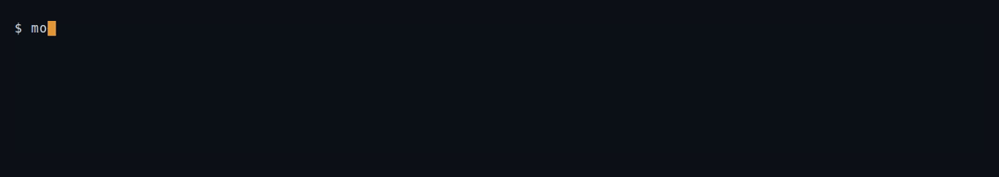

<div align="center">


### Every expert on tap.

CPU inference for sparse mixture-of-experts models.<br>
One binary. Linux, macOS, Windows. No GPU, no BLAS, no Python.

[](https://github.com/JGalego/Moe/actions/workflows/ci.yml)
[](https://github.com/JGalego/Moe/releases/latest)
[](#install)
[](https://www.rust-lang.org)
[](#why-another-engine)
[](LICENSE)

</div>

---

**Better call Moe!** Point it at a Hugging Face repo — or a GGUF file — and it
downloads, caches, and works out what the model is by reading the weights: no
config file, no conversion step, no `--model-type`.


The weights are fetched once with a progress bar, cached, and reused instantly on
every run after that.


## Why another engine

A sparse MoE checkpoint is mostly weights that any given token never touches.
Routing picks a handful of experts per layer, so the arithmetic per token stays
small even when the file is enormous — what actually hurts on a CPU is moving
bytes. Moe is built around that one observation:

- **Copy-free.** Weights are memory mapped and read in place, in whatever format
  they already have. Loading a checkpoint is an `mmap` call, not a deserialise
  pass, so start-up is instant and the resident set is whatever the OS decides to
  keep — a model larger than RAM streams from disk with no special mode.
- **Only what routing selects.** A routed layer touches the experts it chose and
  nothing else. Expert weights are addressed as row ranges inside the checkpoint,
  so selecting an expert costs an offset calculation.
- **One code path for prefill and decode.** A step takes `t` tokens; decode is
  `t == 1`. Each weight row is dequantised once and dotted against every token in
  the batch, so prefill reads each weight once rather than once per token, and
  the MoE layer runs each selected expert once over all the tokens that chose it.
- **Detected, not configured.** Nothing about the architecture is hard-coded.
  Latent attention, qk-norm, sigmoid gating, group-limited routing, shared
  experts, dense-prefix layers, sliding windows, stretched rope — each is
  inferred from the tensors and the config that exist.

That last point is also why the routing is worth *looking* at, which is where much
of what follows comes from.

## Install

A single binary with no runtime dependencies. Linux, macOS and Windows, x86-64
and arm64.

```console
# macOS / Linux
$ curl -fsSL https://raw.githubusercontent.com/JGalego/Moe/main/install.sh | sh

# Windows (PowerShell)
> irm https://raw.githubusercontent.com/JGalego/Moe/main/install.ps1 | iex
```

Or from source, with a Rust toolchain (1.85+):

```console
$ cargo install moe-ontap                              # the crate is `moe-ontap`, the binary `moe`
$ cargo install --git https://github.com/JGalego/Moe    # or straight from source
$ cargo test                                            # full suite, no downloads
```

There is also a `Dockerfile`, a `flake.nix`, and a Homebrew formula in `Formula/`.

Building from source compiles a TLS stack, which wants a C compiler. If you do not
have one — or do not want downloads at all — `--no-default-features` drops both,
leaving an engine that takes local paths. For the best kernels on your own
machine, build with `RUSTFLAGS="-C target-cpu=native"`.

## Use

`<model>` is whatever you have:

```console
$ moe run mistralai/Mixtral-8x7B-v0.1 -p "The capital of France is"   # Hub repo
$ moe run mistralai/Mixtral-8x7B-v0.1@refs/pr/7 -p ...                # a revision
$ moe run ~/models/mixtral -p ... --temp 0.7                          # local directory
$ moe run ./mixtral.moe -p ...                                        # packed file
$ moe run ./mixtral.gguf -p ...                                       # a GGUF file
$ moe run https://example.com/mixtral.moe -p ...                      # direct download
```

Remote models are downloaded once into a cache — `%LOCALAPPDATA%\moe` on
Windows, `~/Library/Caches/moe` on macOS, `$XDG_CACHE_HOME/moe` or `~/.cache/moe`
elsewhere — and reused after that. `MOE_CACHE` moves it, `HF_TOKEN` reaches gated
repos, `--offline` refuses to download, and `moe pull <model>` fetches without
running anything.

Every command:

```console
$ moe run   <model> -p TEXT            generate text
$ moe chat  <model>                    a conversation in the terminal
$ moe serve <model> --port 8080        OpenAI-compatible HTTP server
$ moe pull  <model>                    download into the cache, print the path
$ moe pack  <model> -o out.moe         re-quantise for fast loading
$ moe info  <model>                    architecture, footprint, kv cache size
$ moe bench <model> -n 64              prefill and decode throughput
$ moe route <model> -p TEXT            which experts the routing selected
$ moe eval  <model> --text PATH        perplexity and bits/byte on held-out text
$ moe embed <model> -p TEXT            the pooled hidden state as a vector
$ moe tokenize <model> -p "hello"      token ids, for debugging
$ moe --help                           every flag
```

## Formats

Point it at a Hugging Face directory of `*.safetensors`, a packed `.moe`, or a
**GGUF** file — a single file is identified by its magic, not its extension.

GGUF needs no conversion step. Its `Q4_0`, `Q5_0` and `Q8_0` blocks are
byte-for-byte the engine's own Q4, Q5 and Q8, so those weights are read in place;
`Q4_K` and `Q6_K` have their own readers. The vocabulary, the config and the chat
template all come out of GGUF metadata, so such a file is as self-contained as a
`.moe`.


Then pack it, if you like. Packing re-quantises every weight, drops tensors
inference never reads, and embeds the tokenizer and chat template, giving one
self-contained file:

```console
$ moe pack mistralai/Mixtral-8x7B-v0.1 --quant q8 --expert-quant q4
$ moe run ./Mixtral-8x7B-v0.1.moe -p "Explain routing in one sentence." --stats
```

`--quant` covers the dense trunk, `--expert-quant` the routed experts. Since the
experts are the bulk of the file and the least sensitive part of it, `--quant q8
--expert-quant q4` is a good default:

| format | bits/weight | vs bf16 |
| --- | --- | --- |
| `q4` | 4.5 | 3.56x |
| `q5` | 5.5 | 2.91x |
| `q6` | 6.5 | 2.46x |
| `q8` | 8.5 | 1.88x |

Norms, biases and router gates always stay f32 — they are tiny, and quantisation
noise there feeds straight into routing decisions. And the quality no longer has
to be taken on trust; see [measuring it](#measuring-what-quantisation-costs).

`--hot-experts trace.jsonl` spends bits where they matter: routing is skewed, so
the experts a workload leans on can keep more precision than the ones it barely
touches.

## Serving

```console
$ moe serve allenai/OLMoE-1B-7B-0924 --port 8080 --slots 4 --draft 8
$ curl localhost:8080/v1/completions -H 'content-type: application/json' \
    -d '{"prompt":"The capital of France is","max_tokens":8}'
```


`/v1/chat/completions`, `/v1/completions` (both with `"stream": true`),
`/v1/embeddings`, `/v1/models`, `/health` and `/metrics` — enough of the OpenAI
API that existing clients work without knowing what they are talking to,
including `logprobs`, `n`, `echo`, `stop`, `seed` and `response_format`. `prompt`
also accepts an array of token ids, so a client with no tokenizer can still drive
the model.

**It serves one request at a time, on purpose.** At batch size one the engine is
memory-bandwidth-bound and already uses every core, so concurrent generations
would halve each other's throughput rather than add any. Requests queue instead;
past `--max-queue` they get a 503 rather than piling up.

Queueing on a session is also what makes it quick: the session keeps its KV cache
between requests, so a prompt that extends the last one only prefills what was
added. Measured on OLMoE with a 125-token prompt, second turn: **1.1s with the
cache against 5.2s without**. `--slots N` keeps several such caches, so two
clients taking turns do not evict each other — with a single slot they reuse
nothing at all. `--no-prefix-cache` turns it off, and `/metrics` reports what the
cache and the drafter are actually saving.

Chat needs a prompt format, and the checkpoint declares its own: the Jinja
`chat_template` from `tokenizer_config.json` is read and rendered, so an instruct
model is prompted the way it was trained. A template using Jinja beyond what the
engine implements falls back to inferring a format from the vocabulary's control
tokens — `<|im_start|>` means chatml, `<|start_header_id|>` llama3, `[/INST]`
mistral — rather than rendering it wrongly. `--chat-format` names one directly,
and `/v1/completions` needs none.

It binds `127.0.0.1` by default, so it is yours until you say otherwise.

## Chatting

```console
$ moe chat allenai/OLMoE-1B-7B-0924-Instruct --stats
```


The conversation is re-rendered through the chat template every turn, which sounds
wasteful and is not: the new render extends the last one, so the cache already
holds everything but the message just typed. A long conversation stays as quick as
a short one. `/reset` keeps the system message and drops the rest.

## Speculative decoding

Decode is bandwidth-bound: reading a layer's weights for eight tokens costs barely
more than for one, and the engine already has one code path for `t` tokens. So
`--draft N` guesses the next few tokens, checks all of them in a single step, and
keeps whatever prefix the model agrees with.

```console
$ moe run <model> -p "..." -n 128 --draft 8
draft 96 of 120 accepted (80%) | 1.71 tokens per forward step
```


No draft model is involved. The guesser looks for the last few tokens occurring
earlier in the same sequence and proposes what followed — free, and it works
exactly where token-at-a-time decoding is most wasteful: quoting a prompt back,
editing code, filling a template, continuing a list. On novel prose it proposes
badly, the acceptance rate falls, and nothing is ever *wrong*; only wasted.

It is lossless, not approximate. Greedily a guess is accepted precisely when it is
the argmax, so the output is bit-identical to not speculating —
[`tests/speculative.rs`](tests/speculative.rs) asserts that at every lookahead.
With temperature, a guess is accepted with probability `p(guess)` and a rejection
draws from the target with the guess removed and renormalised, which is the
standard rejection correction and leaves every emitted token's distribution
untouched.

## Constrained decoding

A model asked for JSON usually produces JSON, and "usually" is the problem. So
instead of asking nicely and retrying on failure, the sampler is given a mask:
tokens whose bytes could not continue a valid document have their logits set to
`-inf`. The model still chooses; it cannot choose something malformed.

```console
$ moe run <model> -p "..." --json                  # any valid JSON
$ moe run <model> -p "..." --schema person.json    # this exact shape
$ curl ... -d '{"response_format": {"type": "json_schema", ...}}'
```


The checker is a pushdown automaton over *bytes*, because a token is an arbitrary
byte string that straddles boundaries — `":"`, `"},{"` and `"\"na"` are all single
tokens in real vocabularies. The schema subset is the part that constrains shape:
`type`, `properties`, `required`, `items`, `minItems`, `maxItems`, `enum` and
`const`. Keywords it does not model stay permissive rather than erroring, so a
schema carrying descriptions and `$id`s still constrains everything it can.

Constraints and speculation compose: a drafted token that would break the grammar
is masked to probability zero, so it is rejected like any other bad guess.

## Seeing the routing

`moe route` reports which experts a prompt selected, and how evenly:

```console
$ moe route <model> -p "def parse(xs): ..." --top 3
OlmoeForCausalLM: 42 tokens, 16 routed layers, 64 experts, top-8
coverage 61% of (layer, expert) pairs touched   mean entropy 0.83   mean peak/uniform 3.1x

  layer  entropy  peak  dead  busiest experts
  L0        0.86   2.4x     9  e17:71%  e3:64%  e41:52%
  L1        0.81   3.6x    14  e52:88%  e9:57%  e22:45%
  ...
```

Three numbers worth having. **Entropy**, normalised, says whether the router is
using its capacity: 1.0 is a perfectly even spread, 0.0 is every token choosing
the same expert. **Peak over uniform** says how lopsided the busiest expert is.
**Coverage** says what fraction of the model a prompt touched at all — which is
the number that makes pruning look worthwhile.

Give it two prompts and it reports the difference, and draws it:

```console
$ moe route <model> -p "import numpy as np ..." \
                    --vs "The French Revolution ..." -o routing.svg
```


Each cell is one expert in one layer; amber means the first prompt picked it more
often, teal the second, grey means neither. The strongly coloured cells are the
point — this checkpoint really does send code and prose to different experts, and
that is why a sparse model can be big without being slow.

`--trace PATH` writes every decision as JSONL if you would rather analyse it
yourself, and `moe route trace.jsonl` reads one back.

## Intervening in the routing

Watching says which experts a prompt used. It cannot say what they are *for* —
that needs the choice changed and the output compared.

```console
$ moe run <model> -p ... --disable-expert '*:41'   # refuse expert 41 everywhere
$ moe run <model> -p ... --force-expert 3:17       # always select it
$ moe run <model> -p ... --router-temp 4           # flatten the choice
$ moe run <model> -p ... --top-k-experts 1         # one expert per token
```

Disabling renormalises the surviving weights, so it asks what happens if an expert
is *unavailable* rather than if its output were zeroed. Forcing displaces the
weakest pick, so top-k does not change and the comparison stays honest. All of it
composes with `moe route`, so before-and-after is one command each.

## Pruning a model to a domain

Put the two together. Trace a workload, keep only the experts it reaches, and what
comes out is a genuinely smaller model — Mixtral, but only the parts that answer
code questions.

```console
$ moe run <model> -p "$(cat code-corpus.txt)" -n 256 --trace code.jsonl
$ moe pack <model> --quant q8 --expert-quant q4 --keep-experts code.jsonl --keep 16
pruning 64 experts per layer to 16 (from 312 tokens of trace; 61% of pairs were used)
```


This is a real model, not a checkpoint with holes in it: kept experts are
renumbered contiguously, the router is narrowed to exactly the rows that survive,
the config is rewritten to match, and `top_k` is clamped to what is left. Every
layer keeps the same *number* of experts — a config declares one count — but the
*sets* differ per layer, which is where the specialisation lives.

Pruning to the set a workload actually used is lossless for that workload, which
[`tests/oracle.rs`](tests/oracle.rs) asserts directly: trace a prompt, keep what
the trace touched, and the pruned model reproduces the original's logits.

## Measuring what quantisation costs

A compression ratio says nothing about whether a model still works. `moe eval`
scores held-out text, and `--vs` scores a second model on the same tokens:

```console
$ moe eval <model> --text wiki.txt --vs model-q4.moe
scoring 48213 tokens, window 2048, stride 1024

OLMoE-1B-7B-0924             ppl   11.204   nll 2.4162   bits/token 3.486   bits/byte 0.812
olmoe-q4.moe                 ppl   11.559   nll 2.4474   bits/token 3.531   bits/byte 0.822

delta                        ppl +0.355 (+3.17%)   nll +0.0312   bits/byte +0.0104
```


Every token is scored with as much left context as the window allows: chunking a
corpus naively scores the first token of each block on nothing and quietly
inflates the result, so windows overlap and each counts only the targets the last
did not reach. Bits-per-byte is reported beside perplexity because perplexity is
per *token*, and two checkpoints that tokenise the same text differently cannot be
compared on it.

## Embeddings

The hidden states were there all along; pooling them instead of unembedding makes
the same checkpoint usable for retrieval.

```console
$ moe embed <model> -p "a cat sat on the mat" --vs "the kitten rested on the rug"
cosine 0.8734   dim 2048   pooling Last

$ moe embed <model> --prompts corpus.txt -o vectors.jsonl
$ curl localhost:8080/v1/embeddings -d '{"input": ["a", "b"]}'
```



`--pool mean|last|first`. Mean is what most sentence encoders expect; last is what
decoder-only embedding models are trained for, since under a causal mask only the
final position has seen the whole input.

## Long context

Four context-extension schemes are implemented and read from the config, because
applying the wrong one looks fine for a few hundred tokens and then degrades
silently: linear position interpolation, NTK-aware base raising, Llama 3's
piecewise-by-wavelength variant, and YaRN's per-frequency ramp with its
compensating attention scale. Sliding windows are honoured too, in all four config
conventions — including checkpoints that alternate local and global layers, so a
local layer's work per token stops growing with the context.

`moe info` reports what it detected:

```console
$ moe info <model>
  rope       theta 500000, Llama3 x8.000 from 8192
  window     4096 on 24 of 32 layers
```

## Going faster

- **`--draft N`** — [speculative decoding](#speculative-decoding), above.
- **Expert prefetch**, on by default. Expert selection is strongly correlated
  between adjacent tokens — the reuse rate under `--stats` measures it — so before
  a decode step the kernel is advised to fetch every expert the *previous* token
  used, at every layer at once. The reads then overlap the whole forward pass
  instead of stalling the layer that needs them, and a wrong guess costs nothing
  but page cache. `--no-prefetch` disables it.
- **`--pin trace.jsonl`** keeps the experts a trace used resident, up to
  `--pin-budget`. Routing is skewed enough that a small pinned set covers most
  tokens.
- **`--warm GB`** faults in weights before decoding starts.
- **`--prompts file.txt`** answers many prompts in one load, reusing the cache
  between them — prompts sharing a preamble prefill only what differs.
- **`--threads N`**, and `RUSTFLAGS="-C target-cpu=native"` at build time.

## Supported models

The engine handles the sparse-decoder family: RMSNorm, rotary embeddings,
grouped-query **or** latent attention, SwiGLU experts with top-k routing.

| Family | What it uses |
| --- | --- |
| OLMoE | GQA, whole-projection qk-norm, unnormalised top-k |
| Mixtral | GQA, softmax routing, per-expert or fused expert weights |
| Qwen2-MoE / Qwen3-MoE | per-head qk-norm, shared expert with its own gate |
| DeepSeek-V2 / V3 | latent attention, sigmoid gate, group-limited routing, shared experts, dense prefix |
| Dense Llama-style | the same path, minus routing |

Anything in this family loads as it is, from safetensors or GGUF; `moe info`
reports what it detected, so a checkpoint tells you what it is before you generate
a token. [docs/MODELS.md](docs/MODELS.md) lists every tensor name and config key
the engine reads.

## Validation

Correctness is checked against implementations written independently of this one.

- **Forward pass.** `scripts/oracle.py` builds tiny checkpoints and runs a
  reference forward pass in pure Python, written from the model definitions
  rather than from this code. Fixtures cover grouped-query attention with both
  qk-norm conventions, latent attention with sigmoid gating and group-limited
  routing, and YaRN scaling with a sliding window on one layer but not the other.
  The engine reproduces the reference logits at every position, under incremental
  decode, batched prefill, split prefill and `forward_all`.
- **GGUF.** The same fixture is rewritten as a real GGUF file — GGUF's names,
  reversed dimensions and stacked experts — and must reproduce the same reference
  logits through that path.
- **Quantisation.** Every block format packs both fixtures and runs a real forward
  pass; more bits must mean more bytes *and* less error.
- **KV cache.** Rewinding and continuing produces the same logits as never having
  cached — the property the server's prefix reuse and speculation both rest on.
- **Speculation.** Greedy output must be byte-identical at lookahead 0, 1, 2, 4, 8
  and 16, on both attention families; and the rejection correction is checked
  against 60k sampled draws per drafted token.
- **Constrained decoding.** The automaton is checked against ~60 valid and invalid
  documents and every possible byte split of one. Then the random-weight fixture —
  a model with no idea what JSON is — is run under a mask and its output parsed.
- **Pruning.** Keeping exactly the experts a trace used must reproduce the
  original's logits.
- **Malformed input.** Every parser that reads a file the user did not write is
  swept with single-byte mutations, every truncation and extreme header lengths,
  asserting nothing panics, hangs or aborts. `fuzz/` holds libFuzzer targets for
  the same surfaces.
- **Tokenizer.** `scripts/tokcheck.py` compares `moe tokenize` against Hugging
  Face's `tokenizers`, in both directions: **226/226** on each of three
  vocabularies.
- **A real model.** OLMoE-1B-7B runs end to end — the recordings above are that
  model, unedited.

```console
$ cargo test                                       # full suite, no downloads
$ python3 scripts/oracle.py tests/fixtures         # regenerate fixtures
$ cargo +nightly fuzz run gguf                     # go deeper
```

Every commit runs the full suite on Linux, macOS and Windows, plus clippy, both
feature sets, a pinned-MSRV build, a throughput floor, and the container.

## How it works

[docs/ARCHITECTURE.md](docs/ARCHITECTURE.md) walks through the whole thing — the
storage layer, the quantisation formats, the forward pass, and where the time
goes. The short version:

| File | Role |
| --- | --- |
| `src/quant.rs` | block formats, dequantise + matmul kernels, AVX2 and NEON |
| `src/model.rs` | weight binding, the forward pass, routing and its overrides |
| `src/store.rs` | mmap safetensors, `.moe` and GGUF; tensor views, packing, pruning |
| `src/gguf.rs` | the GGUF container: metadata, names, dimensions |
| `src/spec.rs` | architecture detection from config + tensor shapes |
| `src/generate.rs` | the decode loop, speculation, verification |
| `src/draft.rs` | guessing the next tokens without a model |
| `src/grammar.rs` | the JSON automaton and the logit mask |
| `src/chat.rs` | the Jinja subset that renders a checkpoint's chat template |
| `src/tokenizer.rs` | `tokenizer.json` BPE, both pre-tokenizer families |
| `src/route.rs` | routing statistics and the SVG |
| `src/eval.rs` | scoring text: perplexity, bits per byte |
| `src/fetch.rs` | resolving paths, URLs and Hub repos; the download cache |
| `src/serve.rs` | the OpenAI API, the prefix-cache pool, chat formats, metrics |
| `src/http.rs` | a small bounded HTTP/1.1 server with SSE |
| `src/sample.rs` | temperature, top-k, top-p, penalties, draft verification |
| `src/main.rs` | CLI |

Recordings are made with [vhs](https://github.com/charmbracelet/vhs) from the
tapes in `tapes/`; `sh scripts/record.sh` regenerates every one.

## License

MIT. See [LICENSE](LICENSE).
